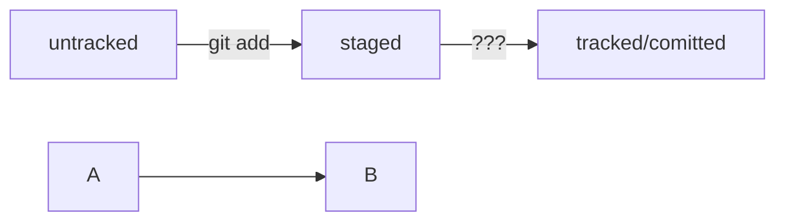

_java-kanban_

# Трекер задач
### Согласно задания спринта № 5.
## выполнено Филипповских Сергеем

_**Когорта-53**_

Для Евгения Семина
В этом спринте в описании задания больше непонятного, чем в прошлом.
Вероятнее всего причина в том, что задачи выдаются дозированно, и из-за непонимания,
что в итоге должно получиться - вопросов с каждым разом всё больше и больше при прочтения задания.
Поэтому, прошу сделать скидку при замечаниях к проекту на то, что делаю всё так как я "понял" задание,
хотя и не понял почему нужно именно так и правильно ли я понял.
Это я к тому - что буду благодарен, если кроме замечания Вы кратко, хотя бы в паре слов поясните, почему именно так и/или в чём моя ошибка в размышлениях.

